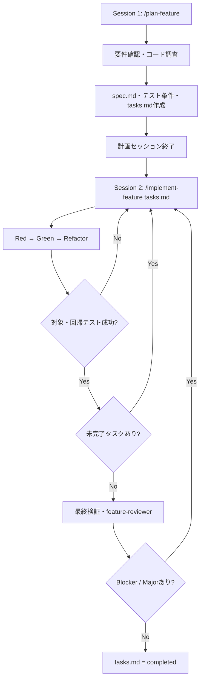

# Claude Code Skill・Agent設計（TDD統合版）

作成日: 2026-08-04  
対象: 最新のClaude Codeを利用した、テスト駆動の機能ドキュメント作成から実装・検証・レビュー完了までの開発フロー

## 1. 目的

機能単位で以下を一貫して実行できるClaude Code構成を定義する。

1. 機能ドキュメントを作成する
2. 受入条件からテストケースを先に定義する
3. 実装タスクへ分割し、`tasks.md`を作成する
4. 計画セッションを終了する
5. 新しいセッションで`tasks.md`から実装を再開する
6. フロントエンド、API、DB、必要なIaC、テスト、レビューを実施する
7. `tasks.md`を更新しながら、検証可能な状態で機能を完了する

設計上の最重要方針は、会話履歴ではなくリポジトリ内の`spec.md`と`tasks.md`をセッション間の引き継ぎ情報とすることである。

## 2. 最終構成

### 2.1 必要なカスタム構成

| 種別 | 名前 | 数 | 主な目的 |
| --- | --- | ---: | --- |
| Skill | `plan-feature` | 1 | 要件確認、機能仕様、受入テスト設計、タスク分割までを行う |
| Skill | `implement-feature` | 1 | `tasks.md`から再開し、Red → Green → Refactorで完了まで進める |
| Agent | `feature-reviewer` | 1 | 実装者とは別コンテキストで仕様・実装・テスト品質を検証する |

### 2.2 利用するClaude Code組み込み機能

| 機能 | 用途 |
| --- | --- |
| メインAgent | 計画の統合、フロント・API・DB・IaCをまたぐ実装、修正判断 |
| `Explore` Agent | 既存コード、類似機能、影響範囲の読み取り調査 |
| `Plan` Agent | Plan modeにおけるコードベース調査 |
| `general-purpose` Agent | 大量のテストログ調査など、独立して要約可能な処理 |
| `/verify` | 必要に応じた手動の実動作確認 |
| `/code-review` | PR前などにユーザーが追加実行する独立コードレビュー |

`/verify`と`/code-review`は現行Claude Codeではユーザー起動型のBundled Skillである。そのため、自動実装フローの必須依存にはせず、`implement-feature`自身の検証処理と`feature-reviewer`を必須ゲートにする。

## 3. 設計原則

### 3.1 計画と実装のセッションを分離する

計画セッションでは、調査、質問、仕様作成、タスク分割だけを実施する。実装は、完成したドキュメントを参照する新しいセッションで開始する。

これにより、要件検討中の会話、却下した案、大量の調査結果を実装セッションへ持ち込まず、実装に利用できるコンテキストを最大化する。

### 3.2 SkillとAgentの役割を混同しない

- Skill: 繰り返し利用する手順、判断基準、ワークフロー
- Agent: 独立したコンテキストで実行し、要約や検証結果を返す作業者
- `CLAUDE.md`: すべてのセッションで必要なプロジェクト共通ルール
- `.claude/rules/`: ファイルパスや領域に応じて適用する規約
- Hook: 必ず同じ条件で実行・禁止したい決定的な処理

### 3.3 実装は技術レイヤーではなく受入条件単位で進める

フロント、API、DBを別々のAgentに実装させることを標準にしない。各タスクは、可能な限り1つのユーザー価値または受入条件を完成させる縦切りタスクにする。

例:

- 悪い分割: DBをすべて作る → APIをすべて作る → フロントをすべて作る
- 推奨分割: 登録機能をDB・API・画面・テストまで完成 → 編集機能を同様に完成

共通契約やDBマイグレーションなどの前提作業が必要な場合のみ、先行タスクとして明示する。

### 3.4 完了判定には証拠を必要とする

コードを作成しただけではタスクを完了にしない。テスト、ビルド、型チェック、Lint、E2E、画面確認など、タスクに定義した検証が成功した場合のみ`done`へ変更する。

### 3.5 TDDは手順ではなく実行可能な仕様として組み込む

TDDの価値は「必ずテストファイルを先に編集する」という儀式ではなく、Claudeへ明確なPass/Failと修正フィードバックを与えることにある。

原則として、各実装タスクは次のループを持つ。

1. 受入条件をテストケースへ変換する
2. 変更前または実装前にテストを実行し、意図した理由で失敗することを確認する（Red）
3. テストを通す最小限の実装を行う（Green）
4. 振る舞いを維持したまま必要な整理を行う（Refactor）
5. 対象テストと関連リグレッションテストを再実行する

長大なTDD手順を常時コンテキストへ入れず、`tasks.md`へ「どの受入条件を、どのテストで、どう検証するか」を具体的に記録する。

## 4. Skill設計

## 4.1 `plan-feature`

### 目的

1回目のセッションで、機能要件を自己完結した仕様と実行可能なタスクへ変換する。

### 推奨フロントマター

```yaml
---
name: plan-feature
description: Create a self-contained feature specification and implementation task plan without modifying product code.
disable-model-invocation: true
---
```

`disable-model-invocation: true`により、Claudeが任意のタイミングで自動起動することを防ぐ。ユーザーが計画開始を明示的に制御する。

### 入力

```text
/plan-feature <feature-slug> <機能概要>
```

例:

```text
/plan-feature user-registration メールアドレスを使用したユーザー登録機能
```

### 責務

1. 機能概要と対象リポジトリを確認する
2. 既存コード、類似機能、利用可能な共通部品を調査する
3. 必要な場合のみ`Explore`を使用し、調査結果を要約して統合する
4. UI/UX、業務ルール、権限、例外、セキュリティ、データ移行、運用について質問する
5. 未確定事項を勝手に補完せず、実装へ影響するものは解消または`blocked`として明記する
6. `docs/features/<feature-slug>/spec.md`を作成する
7. 受入条件を安定したIDで定義する
8. 各受入条件に正常系、異常系、境界値、権限、リグレッション観点のテストケースを定義する
9. テスト種別をユニット、統合、E2E、視覚確認、DB/IaC検証から選択する
10. 受入条件とテストケースから依存関係付きタスクを作成する
11. `docs/features/<feature-slug>/tasks.md`を作成する
12. ドキュメント間の対応関係、テスト可能性、タスクの実行可能性をセルフレビューする
13. `tasks.md`を`ready`にして、ソースコードを変更せずに終了する
14. 次のセッションで実行するコマンドを表示する

### 禁止事項

- 製品コードの実装を開始しない
- 未解決の重大事項がある状態で`ready`にしない
- タスクを「フロント全部」「バック全部」のような巨大単位にしない
- 検証方法のないタスクを作成しない
- 実装内容から逆算した都合のよいテストケースを作らない
- すべてをユニットテストだけで検証しようとしない
- 会話にしか存在しない前提を残さない

### 完了条件

- `spec.md`が会話履歴なしで理解できる
- すべての受入条件にIDが付いている
- すべての受入条件が1つ以上のタスクから参照されている
- すべての重要な受入条件に実行可能なテストまたは具体的な確認方法がある
- タスクの依存関係が明記されている
- 各タスクに完了条件と検証方法がある
- 実装を阻害する未解決事項がない、または明確に`blocked`である
- ソースコードを変更していない

## 4.2 `implement-feature`

### 目的

新しいセッションで`tasks.md`を唯一の進捗ソースとして読み込み、実装、検証、独立レビュー、修正を完了まで継続する。

### 推奨フロントマター

```yaml
---
name: implement-feature
description: Resume a feature from tasks.md and implement, verify, review, and update it until completion.
disable-model-invocation: true
---
```

### 入力

```text
/implement-feature docs/features/<feature-slug>/tasks.md
```

### 開始時の確認

1. 指定された`tasks.md`を読む
2. 対応する`spec.md`を読む
3. `CLAUDE.md`、関連する`.claude/rules/`、既存パターンを確認する
4. Gitの現在のブランチと未コミット差分を確認する
5. `tasks.md`の状態が`ready`、`implementing`、`verifying`、`blocked`のいずれかであることを確認する
6. 仕様とタスクの矛盾、未解決ブロッカー、既存変更との衝突があれば実装前に停止する

### タスク実行ループ

1. 依存タスクが完了している最初の`todo`タスクを選ぶ
2. 選択したタスクを`in_progress`へ更新する
3. 関連する受入条件、既存パターン、変更対象、影響テストを確認する
4. 既存コードを変更する前に、受入条件を表すテストを作成または確認する
5. バグ修正では、必ず不具合を再現するテストを先に作成する
6. テストを実行し、未実装・対象不具合など意図した理由で失敗することを確認する（Red）
7. 最小限の一貫した実装を必要なレイヤーをまたいで行う
8. 対象テストを成功させる（Green）
9. 対象テストが成功した状態で、必要なリファクタリングを行う（Refactor）
10. 対象テストと影響範囲の既存テストを再実行する
11. 失敗した場合は、テストを弱めずに根本原因を修正する
12. Red、Green、リグレッション検証のコマンドと結果を`Evidence`へ簡潔に記録する
13. タスクを`done`へ更新する
14. 次の実行可能なタスクへ進む

同時に`in_progress`にできるタスクは原則1つとする。独立性が明確で、別Worktreeを利用する場合のみ並列化を検討する。

### 最終検証ループ

すべての実装タスクが完了したら、機能全体を`verifying`へ変更し、以下を実施する。

1. 関連ユニットテスト
2. API・DBなどの統合テスト
3. 必要なE2Eテスト
4. 型チェック
5. Lint・フォーマット
6. ビルド
7. DBマイグレーションおよびロールバック確認
8. IaCのvalidate、plan、what-ifなどの非破壊検証
9. UI変更がある場合の実画面確認
10. `feature-reviewer`による独立レビュー
11. BlockerおよびMajor指摘の修正
12. 影響した検証の再実行
13. 必要に応じた再レビュー

### 停止条件

以下の場合は、無理に継続せず`tasks.md`を`blocked`へ更新してユーザーへ確認する。

- 仕様上の重要な判断が不足している
- 破壊的なDB変更や本番リソース変更に承認が必要
- 利用権限、認証情報、外部調整が不足している
- 既存のユーザー変更と競合する
- 受入条件を満たす方法が複数あり、選択が製品仕様へ影響する

### 完了条件

- すべての必須タスクが`done`
- すべての受入条件に実装と検証の対応がある
- TDD対象タスクにRedとGreenの証拠がある
- 必須検証が成功している
- `feature-reviewer`のBlockerおよびMajorが解消済み
- スコープ外の変更がない
- `tasks.md`に完了根拠が記録されている
- 機能全体の状態が`completed`

## 5. Agent設計

## 5.1 `feature-reviewer`

### 目的

実装者とは別の新しいコンテキストで、仕様適合性、正しさ、セキュリティ、検証不足を確認する。

### 推奨フロントマター

```yaml
---
name: feature-reviewer
description: Independently reviews a feature implementation against spec.md and tasks.md after implementation. Reports only correctness, security, scope, and verification gaps.
tools: Read, Grep, Glob, Bash
permissionMode: plan
model: inherit
---
```

`permissionMode: plan`を利用し、レビュー中のコード変更を禁止する。Agentメモリは設定せず、過去の実装判断へ引っ張られない独立レビューを維持する。

### 入力として渡す情報

- 対象`spec.md`のパス
- 対象`tasks.md`のパス
- レビュー対象の基準ブランチまたはコミット
- 変更差分
- 実施済み検証の要約

### レビュー項目

1. すべての受入条件が実装されているか
2. 受入条件に対応するテストまたは検証があるか
3. フロント・API・DB間の型、必須項目、エラー形式が一致しているか
4. 認証・認可・入力検証が適切か
5. SQL、XSS、コマンド注入、秘密情報露出などがないか
6. DB変更に移行、互換性、ロールバックの考慮があるか
7. IaC変更に破壊的影響や環境差異がないか
8. エラー、空データ、境界値、再試行、同時実行が必要範囲で考慮されているか
9. 仕様外の変更や不要な抽象化がないか
10. `tasks.md`の完了主張が実際の差分と証拠に一致するか
11. テストが受入条件から作られ、現在の実装を追認するだけになっていないか
12. テスト対象のロジックを壊した場合にテストが失敗する設計になっているか
13. テストを削除、skip、過度なmock、弱いassertionへ変更して無理に通していないか
14. 正常系だけでなく、必要な異常系、境界値、権限、リグレッションが含まれているか

### 出力形式

```markdown
## Review result

### Blocker
- [ファイル:行] 問題、影響、根拠、必要な修正

### Major
- [ファイル:行] 問題、影響、根拠、必要な修正

### Minor
- 任意改善。完了を妨げないもの

### Requirement coverage
- AC-001: Implemented / Missing / Unverified

### Verdict
- PASS / FAIL
```

以下は指摘しない。

- 個人的なスタイルの好み
- 要件に影響しない命名変更
- 発生し得ないケースへの過剰防御
- 今回のスコープ外の全面リファクタリング

## 6. 作成しないAgent

| Agent候補 | 作成しない理由 |
| --- | --- |
| `feature-planner` | ユーザーとの質疑と計画全体の共有コンテキストが必要。メイン会話内のSkillが適切 |
| `frontend-developer` | API・DB契約と分離すると、インターフェース不整合と再調査が増える |
| `api-developer` | 同上。実装は受入条件単位の縦切りを優先する |
| `database-developer` | DBだけを独立実装すると利用側との整合性を失いやすい |
| `iac-developer` | IaCが大規模かつ独立している場合のみ将来追加する |
| `test-writer` | テストは実装タスクの完了条件に含める。大量ログ時は組み込みAgentを一時利用する |
| `orchestrator` | メインAgentと`implement-feature` Skillが既に調整役を担当するため重複する |

## 7. ドキュメント設計

## 7.1 `spec.md`

`spec.md`は、過去の会話を読まなくても実装とレビューが可能な自己完結文書にする。

### 必須構成

```markdown
# <Feature name>

Status: draft | ready | blocked | completed

## 1. Purpose
## 2. Background
## 3. In scope
## 4. Out of scope
## 5. Users and permissions
## 6. Functional requirements
## 7. Acceptance criteria
## 8. UI behavior
## 9. API contract
## 10. Data model and migration
## 11. Infrastructure impact
## 12. Security and audit
## 13. Errors and edge cases
## 14. Observability
## 15. Test strategy
## 16. Verification
## 17. Open decisions
```

### 受入条件

受入条件には変更されにくいIDを付与する。

```markdown
### AC-001: Valid registration

Given a user who is not registered  
When the user submits a valid email address  
Then the account is created and a confirmation is displayed

Test cases:
- TC-001: Valid input creates the account
- TC-002: Duplicate email returns the defined conflict response
- TC-003: Unauthorized users cannot create an account
```

実装の詳細ではなく、外部から確認できる結果を中心に記述する。

## 7.2 `tasks.md`

`tasks.md`は単なるチェックリストではなく、実行状態、依存関係、完了条件、検証証拠を保持するセッション間ハンドオフ文書とする。

### 必須構成

```markdown
# <Feature name> implementation tasks

Feature status: planned | ready | implementing | blocked | verifying | completed
Specification: ./spec.md
Branch: feature/<feature-slug>

## Execution rules

- At most one task may be in_progress.
- Do not mark a task done without verification evidence.
- Resolve dependencies before starting a task.
- Update this file before ending a session.

## Progress

- Total: 0
- Done: 0
- In progress: 0
- Blocked: 0

## T-010: <Task title>

Status: todo | in_progress | blocked | done
Depends on: T-001
Requirements: AC-001, AC-003
Areas: frontend, api, database

### Objective

### Expected files or components

### Completion criteria

### Test strategy

- Test IDs: TC-001, TC-002
- Test level: unit | integration | E2E | visual | DB | IaC
- Related regression tests:

### Verification

### Evidence

- Red: command and expected failure
- Green: command and passing result
- Regression: related command and passing result

### Notes and decisions

## Final gates

- [ ] All acceptance criteria are covered
- [ ] TDD-targeted tasks include valid Red and Green evidence
- [ ] Unit tests pass
- [ ] Integration tests pass
- [ ] E2E or equivalent verification passes
- [ ] Type check, lint, and build pass
- [ ] Database and IaC changes are validated
- [ ] Independent feature review passes
- [ ] No blocker or major finding remains
```

### タスク分割規則

- 受入条件またはユーザー行動単位を優先する
- 1タスクは1つの明確な成果を持つ
- 1セッション内で理解・実装・検証できる大きさを目安とする
- タスク間の依存関係を明記する
- テストケースを実装前に定義し、受入条件IDと対応付ける
- テストを最後の1タスクへ集約せず、各実装タスクのRed・Green・Refactorに含める
- バグ修正は再現テストを独立した完了条件にする
- 影響を受ける既存テストをリグレッション検証として明記する
- 最終統合・E2E・レビューは独立したFinal gateとして残す
- IaCが不要な機能ではIaCタスクを作らない

## 7.3 TDD適用方針

すべての変更へ同じ形式のTDDを強制しない。対象に応じて、最も信頼できる実行可能な検証を選ぶ。

| 対象 | 適用方針 |
| --- | --- |
| 業務ロジック | 原則としてユニットテストを先に作成する |
| API | 契約、入力検証、認可、エラー形式のテストを先に作成する |
| バグ修正 | 不具合を再現する失敗テストを必須にする |
| DBアクセス | リポジトリ層または実DBを利用した統合テストを中心にする |
| DBマイグレーション | 前進、既存データ、後方互換、ロールバックを検証する |
| UIロジック | コンポーネントテストまたはE2Eテストを利用する |
| UIデザイン | スクリーンショット・視覚比較をPass/Fail条件にする |
| IaC | lint、validate、what-if、plan、ポリシーテストを利用する |
| 設定・文言のみの変更 | TDDを強制せず、対象に合った最小検証を行う |

テストコードもClaudeが生成する場合、テストと実装が同じ誤解を共有する危険がある。受入条件との対応、独立レビュー、既存テスト、統合・E2E検証を組み合わせ、生成テストだけを唯一の正解にしない。

## 8. ディレクトリ構成

```text
.
├── CLAUDE.md
├── .claude/
│   ├── settings.json
│   ├── skills/
│   │   ├── plan-feature/
│   │   │   ├── SKILL.md
│   │   │   └── references/
│   │   │       ├── spec-template.md
│   │   │       └── tasks-template.md
│   │   └── implement-feature/
│   │       └── SKILL.md
│   ├── agents/
│   │   └── feature-reviewer.md
│   └── rules/
│       ├── frontend.md
│       ├── api.md
│       ├── database.md
│       ├── iac.md
│       ├── testing.md
│       └── security.md
└── docs/
    └── features/
        └── <feature-slug>/
            ├── spec.md
            └── tasks.md
```

`references/`にはテンプレートなど、Skill実行時だけ必要になる資料を置く。長いテンプレートを`SKILL.md`へ直接埋め込まず、必要時に参照させる。

## 9. `CLAUDE.md`とRulesの責務

## 9.1 `CLAUDE.md`

全セッションで必要な内容だけを記載し、原則200行未満に保つ。

記載対象:

- リポジトリの主要構成
- パッケージマネージャー
- ビルド、テスト、Lint、型チェックのコマンド
- アーキテクチャ上の重要な制約
- ブランチ、コミット、PR規則
- タスク完了には検証証拠が必要という原則
- コンパクション時に保持すべき情報

コンパクション指示例:

```markdown
When compacting, preserve the active tasks.md path, current task ID,
modified files, unresolved blockers, decisions, and verification commands/results.
```

以下は記載しない。

- 詳細なAPI仕様
- ファイルごとの説明
- 長いチュートリアル
- 特定機能だけで使用する手順
- コードから容易に判断できる情報

## 9.2 `.claude/rules/`

技術領域別の規約は、`paths`フロントマターで対象ファイルに限定する。

例:

```yaml
---
paths:
  - "src/api/**/*.ts"
  - "tests/api/**/*.ts"
---

# API rules

- Validate all external input.
- Use the standard error response contract.
- Update the API schema when the contract changes.
```

推奨分類:

- `frontend.md`: UI構成、状態管理、アクセシビリティ、画面テスト
- `api.md`: 入力検証、エラー形式、認可、API契約
- `database.md`: マイグレーション、互換性、インデックス、ロールバック
- `iac.md`: 命名、環境差異、非破壊検証、秘密情報管理
- `testing.md`: TDD対象、Red/Green証拠、テスト階層、モック方針、実行コマンド
- `security.md`: 認証・認可、秘密情報、監査、主要脆弱性対策

## 10. 実行フロー



### Session 1

```text
claude

/plan-feature user-registration メールアドレスを利用したユーザー登録
```

成果物を確認し、`tasks.md`が`ready`になったらセッションを終了する。

### Session 2

```text
claude

/implement-feature docs/features/user-registration/tasks.md
```

以後、実装状況は`tasks.md`へ記録する。会話が長くなった場合は、論理的なタスク境界で`/compact`または新しいセッションを利用し、同じ`/implement-feature`コマンドで再開する。

## 11. 並列化方針

標準では単一のメインAgentが順番に実装する。

並列化を許可できる条件:

- タスク間に依存関係がない
- 変更ファイルが重複しない
- API契約やDBスキーマが確定している
- 各作業を別Worktreeで分離できる
- 統合担当が明確である

Agent Teamsは実験的機能であり、複数Agent間の会話、共有タスク、トークン使用量が増える。通常の機能開発のデフォルトにはせず、十分に分離可能な大型機能でのみ検討する。

## 12. Hookの位置付け

Hookは初期必須構成に含めない。SkillとRulesで運用を安定させた後、必ず決定的に実行したい処理だけ追加する。

追加候補:

- ファイル編集後のフォーマッター
- 特定ファイルへの書き込み禁止
- `completed`変更時のチェックリスト検証
- 危険なDB・IaCコマンドのブロック
- Stop時の必須検証

曖昧な設計判断やコードレビューをHookへ実装しない。判断を要する処理はSkillまたはAgentへ残す。

## 13. 運用ルール

1. 1機能につき`docs/features/<slug>/`を1つ作成する
2. 計画完了前に実装しない
3. 実装開始後は`tasks.md`を進捗の正とする
4. 同時に複数タスクを`in_progress`にしない
5. TDD対象タスクでは実装前にテスト失敗を確認する
6. テストを弱めて実装を通さない
7. タスク完了時にRed、Green、リグレッションの証拠を残す
8. 仕様変更は`spec.md`、テスト条件、`tasks.md`へ反映する
9. ブロッカーを推測で回避しない
10. 最終レビューは実装者とは別コンテキストで行う
11. Blocker・Major解消前に`completed`へ変更しない
12. 繰り返し発生した規約違反は、チャットで注意し続けず`CLAUDE.md`またはRulesへ反映する

## 14. 将来追加する判断基準

初期段階ではSkillやAgentを増やさない。以下の状況が繰り返し発生した場合のみ追加する。

| 状況 | 追加候補 |
| --- | --- |
| 同じ手順を何度もプロンプトで説明している | 新しいSkill |
| 特定技術の長い参照資料が必要時だけ使われる | Reference Skill |
| 同じ独立調査が毎回大量のコンテキストを消費する | 専用Agent |
| 必ず同じコマンドを実行・禁止する必要がある | Hook |
| 複数リポジトリで同じ構成を共有する | Plugin化 |
| 大型機能が明確に独立した作業へ分割できる | Worktree＋Agent、必要時Agent Teams |

## 15. Claude Code公式ベストプラクティスとの対応

| 公式原則 | 本設計での対応 |
| --- | --- |
| Explore → Plan → Implement → Commit | `plan-feature`と`implement-feature`を別セッションに分離 |
| 仕様完成後は新しいセッションで実装 | `spec.md`・`tasks.md`を作成後、計画セッションを終了 |
| コンテキストを積極的に管理 | Skillのオンデマンド読込、Rulesのパス限定、タスク境界での再開 |
| `CLAUDE.md`を短く保つ | 全セッション共通情報のみ、原則200行未満 |
| 検証可能な成功条件を与える | 各タスクにVerificationとEvidenceを必須化 |
| テストを実行可能な仕様として利用する | 受入条件からテストケースを先に定義し、Red → Green → Refactorで実装 |
| テスト失敗を修正フィードバックに利用する | 失敗理由を確認し、テストを弱めずに実装を修正 |
| 調査はSubagentで分離 | `Explore`を必要範囲だけ使用 |
| 独立したレビューを行う | 読み取り専用`feature-reviewer`を最終ゲートに設定 |
| Skillは繰り返すワークフローに使う | 計画と実装再開を2つのSkillとして定義 |
| Agentは独立して要約できる作業に使う | レビューと大量調査に限定 |
| Agent Teamsを目的に応じて選択する | 標準では不使用、独立性が高い大型機能のみ検討 |

## 16. 公式資料

- [Best practices for Claude Code](https://code.claude.com/docs/en/best-practices)
- [Extend Claude with skills](https://code.claude.com/docs/en/skills)
- [Create custom subagents](https://code.claude.com/docs/en/sub-agents)
- [How Claude remembers your project](https://code.claude.com/docs/en/memory)
- [Extend Claude Code](https://code.claude.com/docs/en/features-overview)
- [Run agents in parallel](https://code.claude.com/docs/en/agents)
- [Automate actions with hooks](https://code.claude.com/docs/en/hooks-guide)
- [Test-Driven Development for Code Generation](https://arxiv.org/html/2402.13521v2)
- [TDAD: Test-Driven Agentic Development](https://arxiv.org/html/2603.17973v1)

## 17. 最終判断

初期の最適構成は、次の3つだけである。

```text
plan-feature Skill
implement-feature Skill
feature-reviewer Agent
```

計画専用Agent、技術レイヤー別Agent、TDD専用Agent、調整専用Agentは作成しない。テスト条件の先行設計を`plan-feature`へ、Red → Green → Refactorと回帰検証を`implement-feature`へ組み込み、独立コンテキストが品質向上へ直接寄与するレビューだけをAgentへ分離する。

この構成により、Skill・Agentを増やさず、ファイル数とトークン消費を抑えながら、機能仕様、テスト設計、タスク分割、セッション再開、フルスタック実装、TDD、回帰検証、独立レビューを一貫して実行できる。
